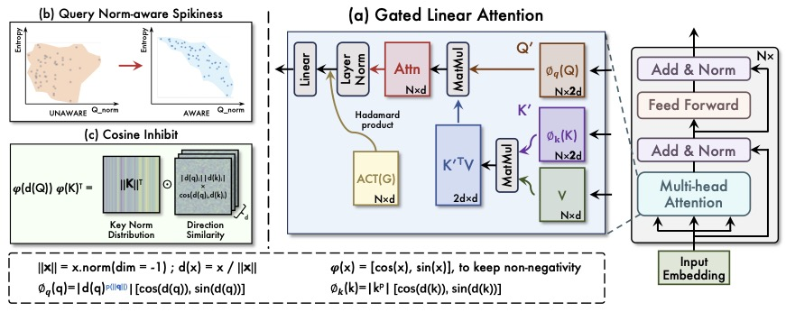
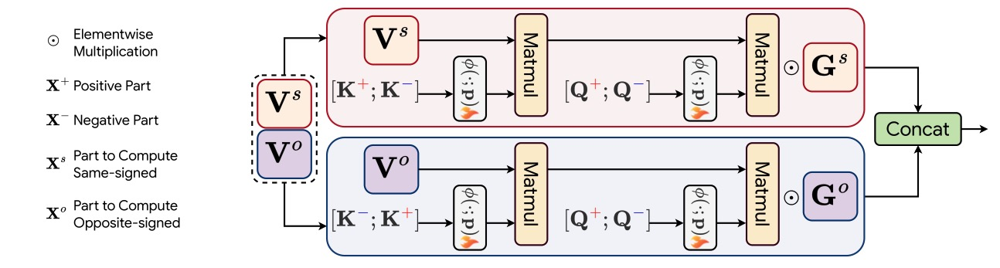

## About me
Weikang (Zachary) is a second-year Ph.D. candidate (2023-) at [SMULL Group](https://cszhengzhang.cn/SMULL/) of [HITsz CS](http://cs.hitsz.edu.cn) advised by Prof. [Zheng Zhang](https://cszhengzhang.cn/). 
He received his B.S. degree in Information and Computational Science at [Harbin Institute of Technology](https://www.hit.edu.cn/) in 2023. 
His research interests lie in efficient training and inference algorithms for large-scale foundation models, particularly linear attentions.

## News
- *2025.01*: &nbsp;🎉🎉 "[PolaFormer: Polarity-aware Linear Attention for Vision Transformers](https://arxiv.org/abs/2501.15061)" is accepted to ICLR'25. 

## Selected Publications
### New work is coming!

To be updated.

New Work

---

### PolaFormer: Polarity-aware Linear Attention for Vision Transformers

***Weikang Meng**, Yadan Luo, Xin Li, Dongmei Jiang, Zheng Zhang* 

*International Conference on Learning Representations (ICLR), 2025*

[[Paper]](https://arxiv.org/abs/2501.15061) [[Code]](https://github.com/ZacharyMeng/PolaFormer)

ICLR 2025

This work presented a novel attention mechanism with linear complexity called PolaFormer. Our PolaFormer computed the similarity in a polarity-aware form to avoid neglecting negatives, at the same time, we theoretically proposed a familty of element-wise functions to make the attention weight more spiky and employ a learnable power function for simplicity and rescaling.

## Honors and Awards
- *2018.09* National High School Mathematics League, Provincial first prize

## Educations
- *2023.08 - now*, Ph.D student, Harbin Institute of Technology, Shenzhen, Computer Science and Technology
- *2019.08 - 2023.07*, Undergrauate student, Harbin Institute of Technology, Information and Computational Science
- *2016.08 - 2019.07*, Harbin NO.3 High School
